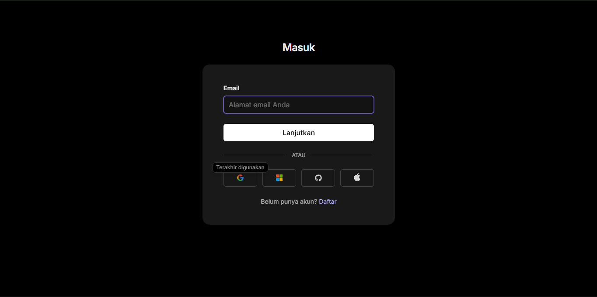
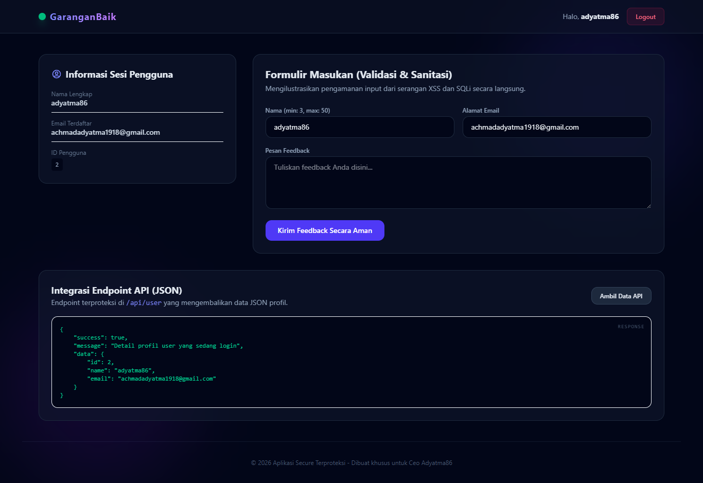
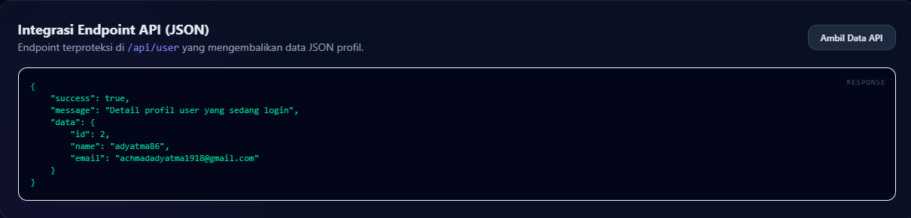
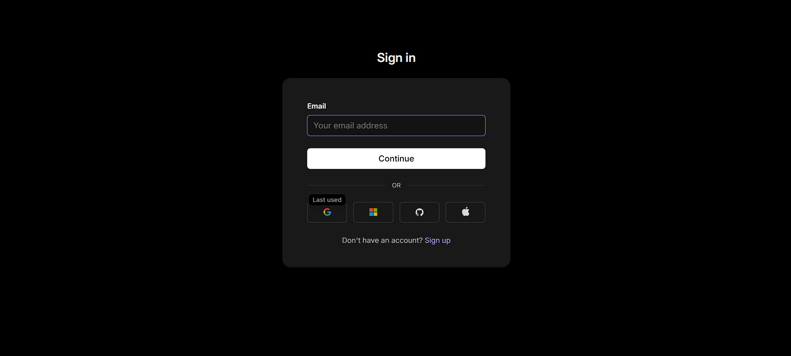

<div align="center">

  

  # 🔐 **Secure App**
  
  **Secure App** adalah platform autentikasi modern berbasis **Laravel 12** yang terintegrasi dengan **WorkOS AuthKit** untuk mendukung sistem Single Sign-On (SSO) yang aman dan efisien.

  [](https://laravel.com)
  [](https://php.net)
  [](https://tailwindcss.com)
  [](https://workos.com)

</div>

---

## 📌 Tentang Aplikasi

**Secure App** dirancang sebagai percontohan (blueprint) aplikasi web yang mengutamakan aspek keamanan data dan kemudahan proses masuk (login) pengguna. Dengan memanfaatkan **WorkOS AuthKit (OAuth 2.0)**, pengguna dapat masuk menggunakan penyedia identitas global tanpa memerlukan registrasi manual. 

Selain autentikasi, proyek ini mendemonstrasikan proteksi terhadap kerentanan umum seperti *SQL Injection (SQLi)*, *Cross-Site Scripting (XSS)*, dan *Cross-Site Request Forgery (CSRF)*.

---

## ⚡ Fitur Utama

- 🔑 **SSO via WorkOS AuthKit** – Autentikasi Single Sign-On yang aman, cepat, dan modern menggunakan OAuth 2.0.
- 🛡️ **Dashboard Terproteksi** – Pembatasan akses halaman dashboard hanya bagi pengguna yang memiliki sesi aktif.
- 🧪 **API Secure Endpoint** – Menyediakan REST API terproteksi (`/api/user`) yang mengembalikan data profil pengguna terautentikasi dalam format JSON.
- ✍️ **Formulir Feedback dengan Proteksi Berlapis** – Dilengkapi dengan validasi input server-side yang ketat untuk mencegah serangan injeksi.
- 🍃 **UI Terang & Modern** – Antarmuka bersih, responsif, dan elegan dengan sentuhan warna biru yang profesional.

---

## 💻 Tech Stack

Aplikasi ini dibangun menggunakan ekosistem teknologi modern:

| Komponen | Teknologi | Keterangan |
| :--- | :--- | :--- |
| **Framework utama** | Laravel 12 | PHP Framework untuk pengembang web |
| **Runtime** | PHP 8.2+ | Bahasa pemrograman backend utama |
| **Autentikasi** | WorkOS AuthKit | Layanan SSO & Manajemen Pengguna berbasis OAuth 2.0 |
| **Database** | MySQL | Penyimpanan data relasional |
| **Frontend** | Blade + Tailwind CSS | Templating engine dan utility-first CSS framework |
| **Build Tool** | Vite | Module bundler frontend yang super cepat |

---

## 📸 Antarmuka Aplikasi

| Halaman | Deskripsi | Preview |
| :--- | :--- | :--- |
| **Login Gateway** | Pintu masuk aman terintegrasi WorkOS |  |
| **User Dashboard** | Panel utama informasi profil pengguna |  |
| **API Endpoint JSON** | Data profil yang diakses aman via endpoint |  |
| **Postman API Client** | Contoh respon JSON terautentikasi |  |

---

## 🚀 Panduan Instalasi

Ikuti langkah-langkah di bawah ini untuk menjalankan **Secure App** di lingkungan lokal Anda:

### 1. Kloning Repositori
```bash
git clone https://github.com/Yann9Scnd/LK10-Pemrogaman-Web.git
cd LK10-Pemrogaman-Web
```

### 2. Instal Dependensi Backend
Gunakan Composer untuk menginstal semua package PHP:
```bash
composer install
```

### 3. Instal Dependensi Frontend
Gunakan npm untuk menginstal package JavaScript/CSS:
```bash
npm install
```

### 4. Konfigurasi Environment (`.env`)
Salin berkas template `.env.example` ke `.env`:
```bash
cp .env.example .env
```
> 💡 **Penting:** Buka berkas `.env` dan konfigurasikan koneksi basis data Anda serta kredensial WorkOS berikut:
> - `WORKOS_CLIENT_ID`
> - `WORKOS_API_KEY`

### 5. Generate Application Key
```bash
php artisan key:generate
```

### 6. Jalankan Migrasi Database
```bash
php artisan migrate
```

### 7. Build File Aset Frontend
Lakukan kompilasi aset CSS dan JavaScript:
```bash
npm run build
```

### 8. Jalankan Server Lokal
```bash
php artisan serve
```
Aplikasi kini dapat diakses melalui browser di alamat [http://localhost:8000](http://localhost:8000).

---

## 📁 Struktur Proyek Utama

Berikut adalah letak berkas-berkas penting pada aplikasi ini:

```bash
├── app/
│   └── Http/
│       └── Controllers/
│           ├── AuthController.php      # Menangani alur autentikasi WorkOS SSO
│           └── DashboardController.php # Mengelola data dashboard & feedback
├── resources/views/
│   ├── login.blade.php                 # Tampilan halaman masuk (Gateway)
│   └── dashboard.blade.php             # Tampilan panel utama pengguna
├── routes/
│   └── web.php                         # Definisi rute web dan API
└── penjelasan.md                       # Analisis keamanan & checklist proteksi
```

---

<div align="center">
  <p>Dikembangkan dengan 💙 oleh <strong>Muhammad Mardiansyah</strong> &copy; 2026</p>
</div>
